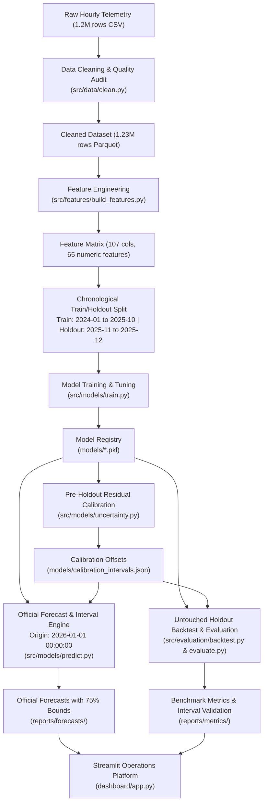

# Djezzy Network Traffic Forecasting & Capacity Planning Platform

[](https://www.python.org/downloads/)
[](https://github.com/psf/black)
[](tests/)
[](https://streamlit.io/)

> **IMPORTANT DISCLAIMER**: This project operates on **100% synthetic network telemetry data** generated for benchmarking and training purposes. The figures, cell identifiers, and values do not represent real-world internal Djezzy network operations.

---

## 1. Executive Summary & Business Problem

In mobile telecommunications networks, data traffic exhibits sharp diurnal, weekly, and seasonal swings driven by user mobility, work shifts, holidays, and cultural events such as Ramadan. Mobile network operators like Djezzy face two opposing risks:
1. **Under-provisioning**: High Physical Resource Block (PRB) utilisation (>80% warning, >90% severe congestion) leads to degraded Quality of Service (QoS), packet drops, latency spikes, and customer churn.
2. **Over-provisioning**: Over-allocating spectrum and hardware capacity inflates Capital Expenditure (CAPEX) and Operational Expenditure (OPEX).

### Project Objectives
- **Target 1 (`dl_traffic_volume_gb`)**: Accurately predict downlink data volume (GB/hour) per cell.
- **Target 2 (`prb_utilization_pct`)**: Accurately predict radio resource block load (% utilisation) per cell.
- **Dual Forecasting Horizons**:
  - **Short-Term (24h Ahead)**: Operational dispatch, dynamic carrier configuration, real-time load balancing.
  - **Medium-Term (7d Ahead)**: Weekly capacity planning, maintenance scheduling, event provisioning.
- **75% Prediction Intervals**: Produce statistically calibrated lower and upper uncertainty bounds (`lower_75`, `upper_75`) surrounding each point prediction (`predicted`) across all 78 cells and horizons.
- **Congestion Alerting**: Automatically detect imminent cell-level saturation ($\text{PRB} \ge 80\%$ WARNING, $\text{PRB} \ge 90\%$ HIGH) and provide probabilistic advisory notifications when the uncertainty band crosses thresholds.
- **Interactive Decision-Support UI**: Provide network operations engineers with an enterprise-grade Streamlit application styled in Djezzy's brand visual identity (red, white, charcoal).

---

## 2. End-to-End System Architecture



---

## 3. Dataset Description & Cleaning Pipeline

The raw dataset spans two full calendar years (2024–2025) of hourly observations across 78 individual radio cells distributed over 28 physical sites and 25 Algerian Wilayas.

### Data Cleaning Protocol (`src/data/clean.py`)
1. **Deduplication**: Resolves 12,254 duplicate `(cell_id, timestamp)` observations using the earliest valid record.
2. **Categorical Normalisation**:
   - Standardises radio technology labels: `LTE`, `4g`, `4G`, `LTE-A` $\rightarrow$ `4G`; `3G`, `UMTS` $\rightarrow$ `3G`; `2G`, `GSM` $\rightarrow$ `2G`; `5G`, `NR` $\rightarrow$ `5G`.
   - Normalises Wilaya names (e.g. `ALGER` $\rightarrow$ `Alger`, `ORAN` $\rightarrow$ `Oran`) and trims whitespace across 25 official Algerian Wilayas.
3. **Range & Sanity Corrections**:
   - Negative downlink traffic (`dl_traffic_volume_gb < 0`, 2,469 entries) is replaced with NaN and imputed causally.
   - PRB utilisation exceeding 100% (4,926 entries) and cell availability exceeding 100% (1,846 entries) are capped at physical limits of 100.0%.
   - Active users exceeding RRC connected users are bounded ($U_{\text{active}} \le U_{\text{rrc}}$).
   - Re-derives the ground-truth `congestion_flag` binary flag based on `prb_utilization_pct >= 80.0`.
4. **Causal Missing Value Imputation (Zero Lookahead)**:
   - Uses strictly forward fill (`ffill()`) within each individual cell series to propagate past observed states without peeking into the future.
   - **No Backward-Fill (`bfill`)**: Backward-filling future data into past missing values is strictly avoided to prevent temporal contamination. Leading missing values prior to a cell's first record are imputed using the pre-holdout historical training median.
5. **Output**: `data/processed/djezzy_cleaned.parquet` (1,225,932 clean rows).

---

## 4. Feature Engineering (`src/features/build_features.py`)

A total of **107 features** are derived, spanning 65 strictly numeric predictive regressors:
- **Calendar & Cyclical Dynamics**:
  - Hour of day ($0 \dots 23$), day of week ($0 \dots 6$), month ($1 \dots 12$), day of year.
  - Sin/Cos cyclical transforms for diurnal ($\sin(2\pi h / 24)$) and weekly ($\sin(2\pi d / 7)$) rhythms.
- **Algerian Cultural & Holiday Indicators**:
  - Algerian weekend flag (Friday & Saturday).
  - Ramadan month indicators (2024: March 11 – April 9; 2025: February 28 – March 29) to capture midnight traffic spikes and reduced daytime activity.
  - Official national holidays (Revolution Day, Independence Day, Eid al-Fitr, Eid al-Adha, Mawlid, etc.).
- **Temporal Lag Features**:
  - $t-1, t-2, t-3, t-24, t-48, t-168$ for both DL Traffic and PRB utilisation.
- **Rolling Window Statistics**:
  - 24-hour and 7-day rolling means, standard deviations, and maximums.
- **Interaction & Capacity Proxies**:
  - Cell traffic density, historical traffic-to-PRB efficiency ratios, and technology/area ordinals.

---

## 5. Temporal Leakage Prevention (Strict Audit)

A core flaw in naive forecasting systems is **lookahead leakage**—accidentally feeding true $t-1$ observations into a 24-hour or 7-day forecast. In an operational setting, at forecast origin $T_0$, ground truth for $T_0 + 1 \dots T_0 + H$ is completely unknown.

### Leakage Audit & Fix:
- **Joint Recursive Autoregressive Rollout**:
  - Forecasts are computed step-by-step ($h = 1, 2, \dots, H$).
  - For $h = 1$, historical lags ($t-1, t-2, \dots$) are taken from observed data before $T_0$.
  - For $h > 1$, lag-1 through lag-$(h-1)$ are populated **strictly using the model's own past predictions**.
  - Cross-target dependency: predicted $\widehat{\text{DL}}$ at step $h$ dynamically informs the feature set for predicting $\widehat{\text{PRB}}$ at step $h+1$.
- **Validation**:
  - Automated unit test `test_no_temporal_lookahead_in_recursive_rollout` in `tests/test_leakage_and_forecast.py` asserts that no ground-truth values from the horizon window ever enter the model inputs.

---

## 6. Validation Methodology & Model Benchmarking

The evaluation strictly adheres to **chronological time-series validation**:
- **Training Period**: `2024-01-01 00:00:00` to `2025-10-31 23:00:00` (22 months, ~1.1M cell-hours).
- **Untouched Final Holdout**: `2025-11-01 00:00:00` to `2025-12-31 23:00:00` (2 months, ~114k cell-hours).
- **No Random K-Fold Shuffling**: Preprocessing and encoders are fitted strictly on training data.

### Model Families Evaluated
1. **Naive Baseline**: Projects the last observed value ($t_0$) across all future steps.
2. **Seasonal Naive (Yesterday)**: Projects values from 24 hours prior ($t - 24$).
3. **Seasonal Naive (Last Week)**: Projects values from 168 hours prior ($t - 168$).
4. **Moving Average (24h)**: Projects the 24-hour trailing historical mean.
5. **Ridge Linear Regression**: L2-regularised linear model.
6. **Random Forest**: Ensemble of 100 decorrelated decision trees.
7. **XGBoost**: Extreme Gradient Boosting with shrinkage and depth regularisation.
8. **LightGBM**: Gradient-boosted decision trees using histogram-based splitting.

---

## 7. Final Holdout Evaluation Results

All metrics are computed on the untouched holdout window using strict recursive forecasting:

### Target: Downlink Traffic Volume (`dl_traffic_volume_gb`)

| Horizon | Model / Baseline | MAE (GB) | RMSE | MAPE (%) | sMAPE (%) | WAPE (%) | Outcome vs Best Baseline |
|:-------:|:-----------------|:--------:|:----:|:--------:|:---------:|:--------:|:------------------------:|
| **24h** | **Random Forest** | **0.9444** | 4.1301 | 78.05% | 28.97% | **26.38%** | **Beats Best Baseline (+51.5% WAPE gain)** |
| 24h | **LightGBM** | 1.3473 | **3.0711** | 598.89% | 66.72% | 37.64% | Beats Best Baseline (+30.8% WAPE gain) |
| 24h | Naive Baseline | 1.9468 | 3.5447 | 105.81% | 54.70% | 54.38% | Reference Baseline |
| 24h | Seasonal Naive (Yesterday) | 2.1648 | 88.0013 | 52.74% | 20.19% | 60.47% | Baseline |
| 24h | Ridge Regression | 2.2751 | 14.5548 | 552.57% | 100.27% | 63.55% | Baseline |
| 24h | XGBoost | 2.4387 | 15.5962 | 195.73% | 51.99% | 68.12% | Baseline |
| **7d** | Seasonal Naive (Last Week) | **2.2517** | 102.9343 | **50.89%** | **21.69%** | **57.93%** | Reference Baseline |
| 7d | Naive Baseline | 2.4724 | 51.7781 | 115.04% | 57.07% | 63.61% | Baseline |
| 7d | Seasonal Naive (Yesterday) | 2.7021 | 105.5549 | 63.69% | 22.56% | 69.52% | Baseline |
| 7d | Random Forest | 3.0139 | 53.4253 | 390.27% | 55.01% | 77.55% | Autoregressive Rollout |
| 7d | LightGBM | 8.3672 | 62.4477 | 4871.46% | 97.93% | 215.28% | Autoregressive Rollout |

### Target: PRB Utilisation (`prb_utilization_pct`)

| Horizon | Model / Baseline | MAE (%) | RMSE | MAPE (%) | sMAPE (%) | WAPE (%) | Outcome vs Best Baseline |
|:-------:|:-----------------|:-------:|:----:|:--------:|:---------:|:--------:|:------------------------:|
| **24h** | **LightGBM** | **3.8813** | **5.7757** | **18.04%** | **11.55%** | **9.03%** | **Beats Best Baseline (+24.6% WAPE gain)** |
| 24h | XGBoost | 3.9242 | 5.8113 | 23.66% | 11.72% | 9.13% | Beats Best Baseline |
| 24h | Random Forest | 4.1096 | 6.0297 | 24.73% | 12.19% | 9.56% | Beats Best Baseline |
| 24h | Ridge Regression | 4.8016 | 6.8671 | 37.44% | 14.39% | 11.17% | Beats Best Baseline |
| 24h | Seasonal Naive (Yesterday) | 5.1455 | 7.8090 | 29.20% | 14.78% | 11.97% | Reference Baseline |
| 24h | Moving Average (24h) | 13.3960 | 16.4960 | 89.52% | 36.37% | 31.17% | Baseline |
| **7d** | **LightGBM** | **4.0725** | **6.4571** | **13.31%** | **11.57%** | **9.52%** | **Beats Best Baseline (+31.5% WAPE gain)** |
| 7d | XGBoost | 4.1318 | 6.4997 | 14.40% | 11.75% | 9.66% | Beats Best Baseline |
| 7d | Random Forest | 4.4015 | 6.7815 | 15.81% | 12.70% | 10.29% | Beats Best Baseline |
| 7d | Seasonal Naive (Last Week) | 5.9476 | 9.8659 | 26.56% | 16.69% | 13.90% | Reference Baseline |
| 7d | Seasonal Naive (Yesterday) | 5.9934 | 9.1674 | 20.22% | 16.60% | 14.01% | Baseline |
| 7d | Moving Average (24h) | 13.8979 | 17.2108 | 62.99% | 37.41% | 32.48% | Baseline |

---

## 8. 75% Prediction Intervals & Uncertainty Quantification

### Methodological Concept: Prediction Interval vs. Confidence Interval
In operational network forecasting, NOC engineers require both a best conditional point forecast $\widehat{y}_t$ and a statistically defensible measure of future observation dispersion:
- **Point Forecast ($\widehat{y}_t$)**: The model's single best conditional estimate.
- **75% Prediction Interval ($[L_{0.75}, U_{0.75}]$)**: An interval constructed to contain the **actual future realization** $y_t$ approximately 75% of the time under calibration assumptions.
- **Prediction Interval vs. Confidence Interval**: A *confidence interval* quantifies sampling uncertainty around an unobservable population parameter (e.g. regression coefficient $\beta$). A *prediction interval* must account for both model parameter uncertainty **and** the intrinsic variance of individual future observations ($\sigma^2_{\epsilon}$). Prediction intervals are therefore wider and designed for future data points rather than parameter estimates.

### Calibration Strategy (Conformal Walk-Forward Residuals)
To guarantee strict statistical defensibility and zero temporal lookahead:
1. **Holdout Isolation**: The final evaluation period (**November 1 – December 31, 2025**) was completely isolated and never used for calibration.
2. **Pre-Holdout Calibration Origins**: Calibration residuals $e(h) = |y(h) - \widehat{y}(h)|$ were collected by running recursive walk-forward backtests across 4 historical pre-holdout dates: `2025-07-01`, `2025-08-01`, `2025-09-01`, and `2025-10-01`.
3. **Horizon-Aware Step Calibration**: Because uncertainty accumulates over recursive multi-step forecasting, calibration is step-dependent:
   $$q_{75}(h) = \text{Quantile}_{0.75}\left(\{|y_{i}(h) - \widehat{y}_{i}(h)| : i \in \text{cells}, \text{origins}\}\right) \quad \text{for } h = 1, \dots, H$$
   - DL 24h uncertainty margin: $\pm 1.25$ GB/h (mean width $2.50$ GB/h)
   - DL 7d uncertainty margin: widens progressively to $\pm 4.53$ GB/h (mean width $9.06$ GB/h)
   - PRB 24h uncertainty margin: $\pm 5.20\%$ (mean width $10.41\%$)
   - PRB 7d uncertainty margin: $\pm 5.67\%$ (mean width $11.34\%$)
4. **Physical Boundary Enforcement**:
   - Downlink traffic: $\text{lower\_75} = \max(0.0, \widehat{y} - q_{75}(h))$, $\text{upper\_75} = \max(0.0, \widehat{y} + q_{75}(h))$
   - PRB utilisation: $\text{lower\_75} = \text{clip}(\widehat{y} - q_{75}(h), 0.0, 100.0)$, $\text{upper\_75} = \text{clip}(\widehat{y} + q_{75}(h), 0.0, 100.0)$
   - Ordering guaranteed: $\text{lower\_75} \le \text{predicted} \le \text{upper\_75}$.

### Holdout Empirical Validation (Nov–Dec 2025)
Evaluated across untouched holdout origins (`2025-11-03` and `2025-12-01`):

| Target | Horizon | Nominal Coverage | Empirical Holdout Coverage | Mean Interval Width | Mean Winkler Score |
|---|---|---|---|---|---|
| `dl_traffic_volume_gb` | **24h** | 75.0% | **76.98%** | 2.4785 GB/h | 7.0770 |
| `dl_traffic_volume_gb` | **7d** | 75.0% | **73.26%** | 8.7998 GB/h | 54.5729 |
| `prb_utilization_pct` | **24h** | 75.0% | **75.79%** | 10.4162 % | 16.7821 |
| `prb_utilization_pct` | **7d** | 75.0% | **76.75%** | 11.3562 % | 18.1942 |

### Known Methodological Limitations
- **Homoscedasticity across cells**: Offsets are calibrated by target and horizon step across the network. Cells with extraordinarily high traffic volume will have tighter relative intervals, while quiet rural cells will have wider relative intervals.
- **Non-guaranteed coverage in extreme shocks**: A 75% prediction interval is an empirical expectation under baseline operational conditions, not an absolute guarantee during major physical outages.

---

## 9. Official Forecasts & Congestion Alerting

Forecast Origin: **`2026-01-01 00:00:00` (Africa/Algiers)** across all **78 active cells**.

- **24-Hour Horizon**: `2026-01-01 00:00` $\rightarrow$ `2026-01-01 23:00` = **1,872 cell-hours**.
- **7-Day Horizon**: `2026-01-01 00:00` $\rightarrow$ `2026-01-07 23:00` = **13,104 cell-hours**.
- **Integrity Validation**: Zero duplicate timestamps, zero missing cell-hour combinations, zero NaN values, and physical clamping ($\text{DL} \ge 0$, $0 \le \text{PRB} \le 100$).

### Congestion Alert Classification
- **WARNING Alert**: Predicted $\text{PRB} \ge 80\%$
- **HIGH CONGESTION Alert**: Predicted $\text{PRB} \ge 90\%$

### Official Alert Counts:
- **24-Hour Horizon**:
  - **126 Total Alerts** (35 HIGH alerts, 91 WARNING alerts) across 21 affected cells.
  - Top congested cells: `DZ-06-1168-L18-1`, `DZ-06-1168-L18-2`, `DZ-15-1457-L18-2`, `DZ-19-0649-L18-2`.
- **7-Day Horizon**:
  - **945 Total Alerts** (335 HIGH alerts, 610 WARNING alerts) across 28 affected cells.

---

## 9. Streamlit Operations Dashboard

The dashboard (`dashboard/app.py`) is styled using Djezzy's brand aesthetic: **Djezzy Red (`#E02B20`)**, clean white cards, dark charcoal typography (`#14171A`), and muted slate accents.

### Dashboard Architecture & Features
1. **Network Overview**:
   - Executive metric cards (Total cells, sites, wilayas, active tech, average DL volume, mean PRB, network congestion rate).
   - Diurnal traffic heatmaps (Hour of day vs Day of week).
   - Technology breakdown and monthly historical trends.
2. **Forecast Analysis**:
   - Interactive horizon switcher (24-Hour vs 7-Day).
   - Hierarchical filtering (Wilaya $\rightarrow$ Site $\rightarrow$ Cell).
   - **Individual Cell Forecasting**: Displays specific cell trajectories without forced network-wide aggregation.
   - Dual-axis interactive charts with 80% (Warning) and 90% (Critical) PRB threshold guides.
3. **Congestion Alerts**:
   - Live alert filter by horizon, wilaya, technology, and severity (ALL, HIGH, WARNING).
   - Real-time incident timeline and alert distributions.
   - Complete tabular audit log with export capabilities.
4. **Cell Deep-Dive**:
   - Dedicated root-cause analysis panel for Radio Access Network (RAN) engineers.
   - Peak predicted traffic, peak predicted PRB, and automated operational status badges (`NORMAL`, `WARNING`, `HIGH CONGESTION`).
5. **Model Performance**:
   - Empirical benchmark tables directly loaded from holdout backtests.
   - Model comparison bar charts comparing Machine Learning models against baseline algorithms.
6. **Data Quality & Audit**:
   - Pipeline health metrics, deduplication summary, categorical normalisations, and temporal completeness checks.

---

## 10. Installation & Quickstart

### Prerequisites
- Python 3.10, 3.11, 3.12, or 3.13
- Git

### 1. Clone & Set Up Environment
```bash
git clone https://github.com/AYA-BACHA/DJEZZY-TRAFFIC-FORECASTING.git
cd DJEZZY-TRAFFIC-FORECASTING

# Create virtual environment
python -m venv .venv
# Activate:
# Linux/macOS:
source .venv/bin/activate
# Windows PowerShell:
.venv\Scripts\Activate.ps1

# Install dependencies
pip install -r requirements.txt
```

### 2. Dataset Placement
Place the synthetic raw CSV file in:
```text
data/raw/djezzy_network_traffic_hourly_2024_2025.csv
```

### 3. Run End-to-End Pipeline
```bash
# 1. Clean data and apply KPI sanity rules
python -m src.data.clean

# 2. Extract 107 calendar, holiday, lag, and rolling features
python -m src.features.build_features

# 3. Train ML models (Ridge, RF, LightGBM, XGBoost)
python -m src.models.train

# 4. Run zero-leakage recursive backtesting on holdout set
python -m src.evaluation.backtest

# 5. Generate official 24h (1,872 rows) and 7d (13,104 rows) forecasts
python -m src.models.predict

# 6. Evaluate forecasts and generate congestion alerts
python -m src.evaluation.evaluate

# 7. Generate Djezzy-themed interactive HTML reports
python -m src.visualization.plots
```
*(Or execute all steps sequentially via `python run_pipeline.py`)*

### 4. Launch the Dashboard
```bash
streamlit run dashboard/app.py
```
Open your browser at `http://localhost:8501`.

---

## 11. Test Suite Verification

Run all unit and integration tests:
```bash
pytest -v
```
**Test Coverage Includes (49 Passed Tests)**:
- `tests/test_clean.py`: Deduplication, technology normalisation, Wilaya casing, KPI boundary capping, binary flag consistency, and **causal imputation (no bfill leakage)**.
- `tests/test_features.py`: Temporal transforms, cyclical coordinates, Algerian weekend indicators, and Ramadan month markers.
- `tests/test_intervals.py`:
  - Physical ordering: `lower_75 <= predicted <= upper_75`.
  - Physical bounds: non-negative DL traffic, PRB $\in [0, 100]$.
  - Zero NaN values in official forecasts.
  - Invariant row counts (1,872 for 24h, 13,104 for 7d).
  - Pre-holdout calibration isolation (zero holdout contamination).
  - Mathematical correctness of empirical coverage and Winkler scores.
- `tests/test_leakage_and_forecast.py`:
  - Mathematical correctness of MAE, RMSE, MAPE, sMAPE, and WAPE with zero-division guards.
  - Baselines: Naive, Seasonal Naive (yesterday/last week), and 24h Moving Average.
  - **Leakage Test**: Asserts zero future ground-truth contamination during autoregressive simulation.
  - Official timestamp alignment and row count invariants (1,872 for 24h, 13,104 for 7d).
  - Alert threshold logic ($\ge 80\%$ and $\ge 90\%$).

```text
============================== 49 passed in 6.39s ==============================
```

---

## 12. Repository Structure

```text
djezzy-traffic-forecasting/
├── config/
│   └── config.yaml                     # Central pipeline configuration & hyperparameters
├── data/
│   ├── raw/                            # Raw telemetry (excluded from git)
│   └── processed/                      # Cleaned parquet & feature matrix (excluded from git)
├── models/
│   ├── calibration_intervals.json      # Pre-holdout calibrated uncertainty intervals
│   └── *.pkl                           # Trained model binaries (LightGBM, RF, XGB, Ridge)
├── notebooks/
│   ├── 01_data_quality_audit.ipynb     # Data profiling and cleaning experiments
│   ├── 02_eda.ipynb                    # Exploratory data analysis & seasonality
│   └── 03_modelling_experiments.ipynb  # Cross-validation & baseline benchmarks
├── reports/
│   ├── evaluation_report.md            # Comprehensive holdout evaluation report
│   ├── figures/                        # Interactive Plotly HTML visualizations
│   ├── forecasts/                      # Official forecasts with 75% prediction intervals
│   └── metrics/                        # Benchmark metrics, feature importance, alert CSVs
├── src/
│   ├── data/
│   │   └── clean.py                    # Production cleaning & causal imputation
│   ├── features/
│   │   └── build_features.py           # Feature engineering & lag generator
│   ├── models/
│   │   ├── baselines.py                # Reference baseline implementations
│   │   ├── train.py                    # Model training & persistence
│   │   ├── uncertainty.py              # Walk-forward 75% interval calibration
│   │   └── predict.py                  # Zero-leakage recursive forecasting engine
│   ├── evaluation/
│   │   ├── metrics.py                  # Standardized metric formulas (WAPE, sMAPE, etc.)
│   │   ├── backtest.py                 # Vectorized holdout simulation
│   │   └── evaluate.py                 # Alert generation & reporting
│   └── visualization/
│       └── plots.py                    # Djezzy-branded visualization routines
├── dashboard/
│   └── app.py                          # Streamlit Operations & Decision-Support UI
├── tests/
│   ├── test_clean.py                   # Data cleaning & causal imputation tests
│   ├── test_features.py                # Feature pipeline test suite
│   ├── test_intervals.py               # 75% prediction interval test suite
│   └── test_leakage_and_forecast.py    # Temporal leakage & forecast test suite
├── requirements.txt                    # Pinned production dependencies
├── run_pipeline.py                     # Master pipeline execution script
├── .gitignore                          # Optimized git exclusions
└── README.md                           # Project documentation (this file)
```

---

## 13. Methodological Limitations & Future Enhancements

### Limitations
1. **Long-Horizon Autoregressive Error Compounding**:
   - In recursive multi-step forecasting, errors from step $t$ propagate into step $t+1$. For 7-day DL traffic rollouts (168 steps), autoregressive tree models compound errors, making Seasonal Naive (last week) competitive for medium-term volume.
2. **Synthetic Telemetry Constraints**:
   - The dataset is 100% synthetic; unexpected network anomalies (fiber cuts, hardware hardware component failures, severe weather events) are modeled statistically rather than from physical telemetry.

### Future Improvements
1. **Direct Multi-Step Forecasting (Seq2Seq / Temporal Fusion Transformers)**:
   - Implement Direct Horizon models or Temporal Fusion Transformers (TFT) with explicit quantile loss to provide confidence intervals ($p10, p50, p90$) and eliminate autoregressive error compounding.
2. **Spatial Topology & Graph Neural Networks (GNN)**:
   - Incorporate inter-site handover matrices and spatial neighbor graphs to model handover traffic bursts between adjacent cells.
3. **Automated Dynamic Thresholding**:
   - Evolve static 80%/90% alert boundaries into dynamic thresholds that adapt to cell classification, carrier bandwidth, and peak usage history.
